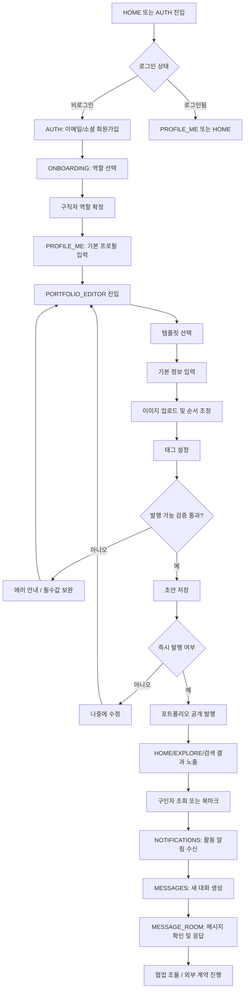
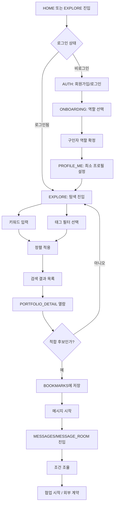
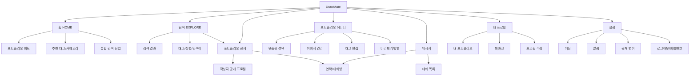

# DrawMate — 유저 플로우 & 정보구조(IA)

버전: Draft v0.1  
작성일: 2026-03-21  
기반 문서: `DrawMate_Project_Guide.docx` 3.2 유저 플로우 & 정보구조, 3.4 디자인 문서군, PRD v0.1

---

## 0. 중요 전제

- 본 문서는 **사용자 여정(User Flow)** 과 **정보구조(Information Architecture)** 를 정의한다.
- 실제 화면 레이아웃과 UI 배치는 확인하지 않았으므로, **구체적 컴포넌트 위치·탭 구조·버튼 배치·모달 유무는 `DrawMate/Wireframe/` 와이어프레임 확인 필요**로 본다.
- 본 문서에서 화면을 언급할 때의 정보는 **기능 흐름과 내비게이션 관점의 추상화**이며, 실제 시각 구조는 반드시 `DrawMate/Wireframe/` 내 JSON/HTML/이미지 기준으로 검증해야 한다.

---

## 1. 문서 목적

이 문서의 목적은 다음 4가지를 명확히 하는 것이다.

1. 구직자(어시스턴트)가 가입부터 포트폴리오 발행, 메시지 수신까지 어떤 여정을 거치는가
2. 구인자(작가/PD)가 탐색부터 후보 발견, 연락까지 어떤 흐름으로 이동하는가
3. DrawMate의 전체 화면 계층 구조가 어떻게 조직되는가
4. 각 화면에서 핵심 행동이 무엇이며 어디서 이탈할 가능성이 높은가

---

## 2. 화면 정의 및 식별자(Screen IDs)

| 화면 ID | 화면명 | 목적 | 와이어프레임 참조 |
|---|---|---|---|
| AUTH | 회원가입/로그인 | 이메일/소셜 인증, 세션 생성 | 실제 화면 레이아웃은 `DrawMate/Wireframe/` 와이어프레임 참조 |
| ONBOARDING | 역할 선택/초기 설정 | 구직자/구인자 역할 설정, 최소 프로필 입력 | 실제 화면 레이아웃은 `DrawMate/Wireframe/` 와이어프레임 참조 |
| HOME | 홈 피드 | 추천/최신 포트폴리오 진입점, 검색 유도 | 실제 화면 레이아웃은 `DrawMate/Wireframe/` 와이어프레임 참조 |
| EXPLORE | 탐색/검색 | 태그 필터, 키워드 검색, 정렬 | 실제 화면 레이아웃은 `DrawMate/Wireframe/` 와이어프레임 참조 |
| PORTFOLIO_DETAIL | 포트폴리오 상세 | 작업물 열람, 태그 확인, 북마크/연락 | 실제 화면 레이아웃은 `DrawMate/Wireframe/` 와이어프레임 참조 |
| PORTFOLIO_EDITOR | 포트폴리오 에디터 | 템플릿 선택, 이미지 업로드, 정보 입력, 발행 | 실제 화면 레이아웃은 `DrawMate/Wireframe/` 와이어프레임 참조 |
| PROFILE_PUBLIC | 공개 프로필 | 사용자 소개, SNS, 포트폴리오 목록 | 실제 화면 레이아웃은 `DrawMate/Wireframe/` 와이어프레임 참조 |
| PROFILE_ME | 내 프로필/내 포트폴리오 | 본인 정보 수정, 포트폴리오 관리 | 실제 화면 레이아웃은 `DrawMate/Wireframe/` 와이어프레임 참조 |
| BOOKMARKS | 북마크 목록 | 관심 포트폴리오 재열람/shortlist 관리 | 실제 화면 레이아웃은 `DrawMate/Wireframe/` 와이어프레임 참조 |
| MESSAGES | 메시지 리스트 | 대화방 목록, unread 진입 | 실제 화면 레이아웃은 `DrawMate/Wireframe/` 와이어프레임 참조 |
| MESSAGE_ROOM | 대화방 | 1:1 대화, 이미지 첨부, 읽음 상태 확인 | 실제 화면 레이아웃은 `DrawMate/Wireframe/` 와이어프레임 참조 |
| NOTIFICATIONS | 알림 센터 | In-app 알림 열람/읽음 처리 | 실제 화면 레이아웃은 `DrawMate/Wireframe/` 와이어프레임 참조 |
| SETTINGS | 설정 | 계정, 알림, 공개 범위, 로그아웃 | 실제 화면 레이아웃은 `DrawMate/Wireframe/` 와이어프레임 참조 |

---

## 3. 구직자(어시스턴트) 유저 플로우

### 3.1 핵심 목표
구직자는 DrawMate 안에서 다음을 완료할 수 있어야 한다.

- 최소 마찰로 가입한다.
- 자신의 강점을 보여줄 포트폴리오를 작성한다.
- 태그와 템플릿으로 자신을 구조화해 노출한다.
- 구인자의 메시지를 빠르게 수신하고 응답한다.

### 3.2 전체 여정 Mermaid 플로우차트

### 3.3 단계별 설명

| 단계 | 사용자 행동 | 시스템 반응 | 핵심 성공조건 | 잠재 이탈 포인트 | 와이어프레임 참조 |
|---|---|---|---|---|---|
| 인증 | 이메일/소셜로 가입 또는 로그인 | 세션 생성, 온보딩 분기 | 가입 완료 시간이 짧을 것 | 인증 실패, 소셜 콜백 오류 | `DrawMate/Wireframe/` 확인 필요 |
| 역할 선택 | 구직자 역할 선택 | 이후 프로필/에디터 흐름 최적화 | 역할 선택이 명확할 것 | 역할 의미 불명확 | `DrawMate/Wireframe/` 확인 필요 |
| 프로필 작성 | 이름, 소개, SNS, 가용시간 입력 | 프로필 저장, 에디터 진입 CTA 제공 | 반복 입력이 최소화될 것 | 입력 항목 과다 | `DrawMate/Wireframe/` 확인 필요 |
| 포트폴리오 작성 | 템플릿 선택, 제목/소개 입력 | Draft 생성 | 첫 저장까지 빠를 것 | 저장 전 이탈, 유효성 오류 | `DrawMate/Wireframe/` 확인 필요 |
| 이미지 구성 | 작품 업로드, 순서 정리, 커버 선택 | 이미지 검증/업로드/미리보기 | 업로드 실패율이 낮을 것 | 대용량 업로드 실패, 순서 변경 불편 | `DrawMate/Wireframe/` 확인 필요 |
| 태그 설정 | 분야/스킬/툴/스타일 선택 | 탐색 인덱스 반영 | 태그 체계가 이해 가능할 것 | 태그 수가 너무 많거나 의미가 중첩됨 | `DrawMate/Wireframe/` 확인 필요 |
| 발행 | 공개 여부 선택, 최종 확인 | 홈/탐색에 노출 | 발행 기준이 명확할 것 | “왜 발행 불가인지” 불명확 | `DrawMate/Wireframe/` 확인 필요 |
| 메시지 수신 | 알림 확인 후 대화방 진입 | unread 처리, 대화방 이동 | 메시지 놓침이 없을 것 | 알림-대화 연결이 약함 | `DrawMate/Wireframe/` 확인 필요 |

### 3.4 구직자 플로우 설계 원칙

- **첫 포트폴리오 작성까지 시간을 줄인다.**  
  회원가입 직후 HOME로 보내기보다, 최소 프로필 입력 후 바로 `PORTFOLIO_EDITOR`로 진입시키는 흐름이 적합하다.
- **초안 저장(Draft Save)을 기본값으로 둔다.**  
  창작물 정리는 시간이 걸리므로, 발행을 강제하기보다 저장 후 재편집을 지원해야 한다.
- **메시지 수신 경로를 짧게 유지한다.**  
  `NOTIFICATIONS → MESSAGES → MESSAGE_ROOM` 흐름은 2~3 클릭 내에 끝나야 한다.
- **공개 포트폴리오가 구직자의 대표 자산이 된다.**  
  게시글 재작성 대신, 기존 포트폴리오 업데이트로 재사용 가능해야 한다.

---

## 4. 구인자(작가/PD) 유저 플로우

### 4.1 핵심 목표
구인자는 DrawMate 안에서 다음을 완료할 수 있어야 한다.

- 필요한 작업 분야에 맞는 후보를 빠르게 좁힌다.
- 포트폴리오와 프로필을 통해 적합성을 판단한다.
- 북마크로 shortlist를 만든다.
- 적합한 사람에게 바로 연락한다.

### 4.2 전체 여정 Mermaid 플로우차트

### 4.3 단계별 설명

| 단계 | 사용자 행동 | 시스템 반응 | 핵심 성공조건 | 잠재 이탈 포인트 | 와이어프레임 참조 |
|---|---|---|---|---|---|
| 진입 | 홈 또는 탐색 진입 | 추천 포트폴리오/필터 CTA 제공 | 비로그인도 일정 수준 탐색 가능 | 로그인 요구가 너무 이르면 이탈 | `DrawMate/Wireframe/` 확인 필요 |
| 인증/온보딩 | 로그인 후 구인자 역할 선택 | 탐색 중심 초기 상태 구성 | 탐색 시작까지 지연이 짧을 것 | 불필요한 프로필 입력 | `DrawMate/Wireframe/` 확인 필요 |
| 검색/필터 | 키워드, 태그, 정렬 적용 | 결과 집합 갱신 | 결과 변화가 예측 가능할 것 | 필터 조합이 복잡해 결과 0건 다발 | `DrawMate/Wireframe/` 확인 필요 |
| 목록 검토 | 썸네일/요약/태그 스캔 | 상세 진입 유도 | 목록에서 후보 1차 판별 가능 | 카드 정보 부족 | `DrawMate/Wireframe/` 확인 필요 |
| 상세 검토 | 갤러리, 설명, 프로필, 가용시간 확인 | 북마크/메시지 액션 제공 | 연락 전 판단 재료 충분 | 정보 부족, 신뢰 신호 약함 | `DrawMate/Wireframe/` 확인 필요 |
| 북마크 | 후보 저장 | shortlist 관리 가능 | 재방문이 쉬울 것 | 저장 상태가 불명확 | `DrawMate/Wireframe/` 확인 필요 |
| 메시지 시작 | 연락 버튼 선택 | 대화방 생성 또는 기존 방 연결 | 첫 연락 UX가 짧고 명확 | 로그인 벽, 메시지 작성 부담 | `DrawMate/Wireframe/` 확인 필요 |

### 4.4 구인자 플로우 설계 원칙

- **검색 결과에서 1차 판단이 가능해야 한다.**  
  모든 후보를 상세 페이지에서만 판단하게 하면 탐색 시간이 길어진다.
- **상세 페이지에서 바로 연락할 수 있어야 한다.**  
  외부 링크 이동이나 별도 문의 프로세스는 초기 응답 시간을 늦춘다.
- **중복 대화방을 만들지 않는다.**  
  동일 사용자와 이미 대화가 있다면 기존 `MESSAGE_ROOM`으로 연결하는 것이 좋다.
- **비로그인 탐색을 허용하되, 연락 시점에서 인증을 요구한다.**  
  이는 초기 유입 장벽을 낮추면서도 연락/북마크 같은 보호 동작은 인증으로 묶는 방식이다.

---

## 5. 정보구조(IA) 트리

> 실제 화면 레이아웃은 `DrawMate/Wireframe/` 와이어프레임 참조.  
> 아래 구조는 **화면 계층과 내비게이션 관계**를 정의한 것이며, 구체적 UI 배치는 와이어프레임 확인 필요.

### 5.1 IA 해석

- `HOME`은 **발견(Discovery)** 중심 진입점이다.
- `EXPLORE`는 **의도 있는 탐색(Intent-driven Search)** 중심 화면이다.
- `PORTFOLIO_DETAIL`은 **판단과 전환(Decision & Conversion)** 을 담당한다.
- `PORTFOLIO_EDITOR`는 **콘텐츠 생산(Creation)** 의 핵심 허브다.
- `MESSAGES`는 **후속 커뮤니케이션** 중심 허브다.
- `PROFILE_ME`는 **자산 관리(My Assets)** 성격이 강하다.
- `SETTINGS`는 운영성 화면이며, 핵심 전환 플로우와는 분리해야 한다.

---

## 6. 화면 전환 매트릭스

| 출발 화면 | 이동 가능 화면 | 진입 조건 / 트리거 | 차단 조건 | 와이어프레임 참조 |
|---|---|---|---|---|
| AUTH | ONBOARDING, HOME | 로그인/가입 성공 | 인증 실패 | 실제 화면 레이아웃은 `DrawMate/Wireframe/` 와이어프레임 참조 |
| ONBOARDING | PROFILE_ME, EXPLORE, PORTFOLIO_EDITOR | 역할 선택 완료 | 필수 값 미입력 | 실제 화면 레이아웃은 `DrawMate/Wireframe/` 와이어프레임 참조 |
| HOME | EXPLORE, PORTFOLIO_DETAIL, AUTH, PROFILE_ME, MESSAGES | 카드 클릭, 검색 클릭, 로그인 CTA | 보호 화면 접근 시 미인증 | 실제 화면 레이아웃은 `DrawMate/Wireframe/` 와이어프레임 참조 |
| EXPLORE | PORTFOLIO_DETAIL, HOME, BOOKMARKS | 결과 카드 클릭, 홈 이동, 북마크 이동 | 북마크는 로그인 필요 | 실제 화면 레이아웃은 `DrawMate/Wireframe/` 와이어프레임 참조 |
| PORTFOLIO_DETAIL | PROFILE_PUBLIC, MESSAGE_ROOM, BOOKMARKS, EXPLORE | 프로필 클릭, 연락, 저장, 뒤로가기 | 연락/저장은 로그인 필요 | 실제 화면 레이아웃은 `DrawMate/Wireframe/` 와이어프레임 참조 |
| PROFILE_PUBLIC | PORTFOLIO_DETAIL, MESSAGE_ROOM | 특정 포트폴리오 클릭, 연락 | 비공개 상태 | 실제 화면 레이아웃은 `DrawMate/Wireframe/` 와이어프레임 참조 |
| PROFILE_ME | PORTFOLIO_EDITOR, BOOKMARKS, SETTINGS, MESSAGES | 수정, 생성, 저장 목록 이동 | 미인증 | 실제 화면 레이아웃은 `DrawMate/Wireframe/` 와이어프레임 참조 |
| PORTFOLIO_EDITOR | PROFILE_ME, PORTFOLIO_DETAIL, HOME | 저장/발행/취소 | 유효성 미통과 시 발행 제한 | 실제 화면 레이아웃은 `DrawMate/Wireframe/` 와이어프레임 참조 |
| BOOKMARKS | PORTFOLIO_DETAIL, MESSAGE_ROOM | 저장 후보 재열람/연락 | 미인증 | 실제 화면 레이아웃은 `DrawMate/Wireframe/` 와이어프레임 참조 |
| MESSAGES | MESSAGE_ROOM, PROFILE_ME, HOME | 대화방 선택, 내비게이션 탭 | 미인증 | 실제 화면 레이아웃은 `DrawMate/Wireframe/` 와이어프레임 참조 |
| MESSAGE_ROOM | MESSAGES, PORTFOLIO_DETAIL, PROFILE_PUBLIC | 뒤로가기, 상대 포트폴리오/프로필 열람 | 상대 포트폴리오 비공개 | 실제 화면 레이아웃은 `DrawMate/Wireframe/` 와이어프레임 참조 |
| NOTIFICATIONS | MESSAGE_ROOM, PORTFOLIO_DETAIL, PROFILE_ME | 알림 항목 클릭 | 연결 리소스 삭제 | 실제 화면 레이아웃은 `DrawMate/Wireframe/` 와이어프레임 참조 |
| SETTINGS | PROFILE_ME, AUTH | 뒤로가기, 로그아웃 | 세션 만료 | 실제 화면 레이아웃은 `DrawMate/Wireframe/` 와이어프레임 참조 |

---

## 7. 각 화면의 핵심 액션과 이탈 포인트

| 화면 | 핵심 액션 | 핵심 전환 | 주요 이탈 포인트 | 대응 방향 | 와이어프레임 참조 |
|---|---|---|---|---|---|
| HOME | 추천 포트폴리오 클릭, 검색 시작, 태그 클릭 | 탐색 또는 상세 진입 | 첫 화면 정보 밀도 과다 / 검색 CTA 약함 | 히어로-검색-피드 구조 단순화 | `DrawMate/Wireframe/` 확인 필요 |
| EXPLORE | 필터 적용, 정렬 변경, 결과 탐색 | 상세 진입, 북마크 | 필터 과복잡, 결과 0건 | 필터 초기화/추천 조합/빈 결과 안내 | `DrawMate/Wireframe/` 확인 필요 |
| PORTFOLIO_DETAIL | 갤러리 열람, 태그 확인, 북마크, 연락 | 메시지 시작 | 정보 부족, 신뢰 지표 부족 | 프로필 요약/태그/가용시간 강조 | `DrawMate/Wireframe/` 확인 필요 |
| PORTFOLIO_EDITOR | 템플릿 선택, 정보 입력, 이미지 업로드, 발행 | Draft 저장, Published 전환 | 업로드 실패, 발행 불가 사유 불명확 | 실시간 검증/자동 저장/에러 가시화 | `DrawMate/Wireframe/` 확인 필요 |
| PROFILE_ME | 프로필 수정, 내 포트폴리오 관리 | 에디터 진입, 공개 프로필 완성 | 동일 정보 반복 입력 | 기본값 재사용, completion indicator | `DrawMate/Wireframe/` 확인 필요 |
| PROFILE_PUBLIC | 공개 프로필 열람, SNS 확인, 연락 | 상세 또는 메시지 이동 | 포트폴리오와 프로필 관계 불명확 | 대표 포트폴리오/소개 구조 강화 | `DrawMate/Wireframe/` 확인 필요 |
| BOOKMARKS | 저장 후보 재검토, 연락 | 상세 또는 대화방 이동 | 저장 목록 정리 기능 부족 | 최신 저장순/태그별 정리 | `DrawMate/Wireframe/` 확인 필요 |
| MESSAGES | 대화방 선택, unread 확인 | MESSAGE_ROOM 진입 | unread 구분 약함 | 최근순, unread badge, 상대 프로필 표시 | `DrawMate/Wireframe/` 확인 필요 |
| MESSAGE_ROOM | 메시지 전송, 이미지 첨부, 읽음 상태 확인 | 협업 조율 지속 | 입력 지연, 첨부 실패, 알림 누락 | optimistic UI, 재시도, 전송 상태 표시 | `DrawMate/Wireframe/` 확인 필요 |
| NOTIFICATIONS | 알림 클릭, 읽음 처리 | 상세/대화 이동 | 알림 종류 혼재, 소음 과다 | 메시지/북마크/시스템 유형 분리 | `DrawMate/Wireframe/` 확인 필요 |
| SETTINGS | 알림/공개 범위 설정, 로그아웃 | 운영 안정화 | 설정 항목 난해 | 범주별 그룹화 | `DrawMate/Wireframe/` 확인 필요 |

---

## 8. 오픈 이슈 및 후속 확인 포인트

1. **비로그인 사용자에게 허용할 탐색 범위**  
   HOME/EXPLORE/PORTFOLIO_DETAIL을 어디까지 공개할지 운영 정책 확정 필요.
2. **북마크 화면의 구조**  
   단순 목록인지, 폴더/컬렉션 구조인지 `DrawMate/Wireframe/` 확인 필요.
3. **메시지 진입 위치**  
   포트폴리오 상세에서 직접 오버레이/모달인지, 전용 대화방 페이지 이동인지 와이어프레임 확인 필요.
4. **프로필 공개 범위 설정 수준**  
   SNS/가용시간/포트폴리오 노출 범위가 개별 제어인지 전체 토글인지 확인 필요.
5. **알림 센터의 정보 구조**  
   탭 분리형인지 단일 리스트형인지 와이어프레임 확인 필요.

---

## 9. 참고 자료

- https://mermaid.js.org/syntax/flowchart.html
- https://mermaid.js.org/syntax/flowchart.html#subgraphs
- 내부 기준 문서: `DrawMate_Project_Guide.docx`
- 내부 와이어프레임 경로: `DrawMate/Wireframe/`
