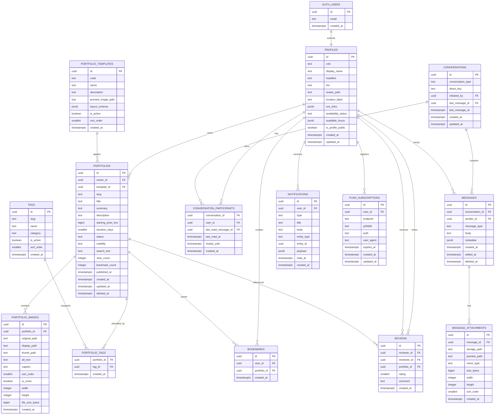

# DrawMate — ERD (DB 설계)

버전: Draft v0.1  
작성일: 2026-03-21  
기반 문서: `DrawMate_Project_Guide.docx` 3.5 ERD, 기능 명세서 v0.1, API 명세서 초안

---

## 0. 기술 기준 버전

> 2026-03 기준 최신 안정 버전 확인 결과를 반영한다. 단, **스키마 SQL 자체는 PostgreSQL 15+ 호환 안전 구문** 위주로 작성하여 Supabase 프로젝트 업그레이드 시 리스크를 줄인다.

| 항목 | 권장 기준 |
|---|---|
| Supabase JavaScript SDK | `@supabase/supabase-js` 2.99.3 |
| Supabase SSR Helper | `@supabase/ssr` 0.9.0 |
| Supabase CLI | `supabase` 2.83.0 |
| Supabase 지원 PostgreSQL 기준 | PostgreSQL 17 지원 기준으로 설계 |
| 스키마 호환 정책 | PostgreSQL 15+ safe subset 우선 사용 |

### 버전 해석 메모
- Supabase 문서는 프로젝트 업그레이드 가이드에 **Postgres 17** 전용 주의사항을 포함하고 있으므로, 관리형 Supabase에서 Postgres 17 사용을 전제로 설계하는 것이 합리적이다.
- 다만 스키마는 생성 칼럼, trigram index, enum, jsonb, partial index 등 **PG15+에서 안정적으로 사용 가능한 기능만 채택**한다.
- 즉, **운영 목표는 PG17 / 이식성 기준은 PG15+** 라는 이중 기준을 취한다.

---

## 1. 문서 목적

본 문서는 DrawMate MVP 및 v1.1 일부 확장 범위를 수용하기 위한 데이터 모델을 정의한다.

핵심 목표는 다음과 같다.

1. Supabase Auth / Storage / Realtime 와 자연스럽게 결합되는 **Supabase-native schema** 구성
2. 포트폴리오 검색, 태그 필터링, 북마크, 메시징, 알림을 안정적으로 지원하는 **정규화된 관계 모델**
3. RLS(Row Level Security), 인덱스, bucket 구조, Realtime 채널 설계를 함께 고려한 **운영 가능한 DB 설계**
4. 이후 v1.1 리뷰/평판, v2.0 AI 매칭/결제 연동으로 확장 가능한 **확장성**

---

## 2. 설계 원칙

### 2.1 Supabase-native 원칙
- 사용자 인증의 source of truth는 `auth.users` 이다.
- 애플리케이션 프로필은 `public.profiles` 에 1:1 확장한다.
- 파일 메타데이터는 앱 테이블에 저장하되, 실제 파일 조작은 **항상 Storage API** 를 통해 수행한다.

### 2.2 검색 설계 원칙
- DrawMate는 한국어 검색 비중이 높으므로, MVP에서는 **태그 기반 구조화 탐색 + `pg_trgm` 기반 키워드 검색** 조합을 채택한다.
- PostgreSQL 기본 FTS는 한국어 토큰 품질이 제한적이므로, 검색창은 제목/요약/설명에 대한 trigram 검색으로 시작한다.
- 향후 v1.1 이후 고도화 필요 시 `PGroonga` 또는 별도 검색 인덱스 도입을 검토한다.

### 2.3 메시징 설계 원칙
- MVP는 **1:1 direct conversation only**
- 중복 대화방 방지를 위해 `conversations.direct_key` 를 unique 로 둔다.
- 읽음 상태는 `conversation_participants.last_read_message_id / last_read_at` 로 관리한다.

### 2.4 공개/비공개 설계 원칙
- 공개 탐색 대상은 `portfolios.status = 'published'` 이고 `visibility = 'public'` 인 데이터만 허용한다.
- Draft/Archived 데이터는 작성자 본인 외 접근 불가다.
- 채팅 첨부와 원본 포트폴리오 이미지는 private bucket 우선 정책을 적용한다.

### 2.5 카운터 설계 원칙
- `view_count`, `bookmark_count` 등은 조회 최적화를 위해 포트폴리오 테이블에 denormalized counter 로 둔다.
- 카운터 갱신은 Database Function/RPC 로 일관 처리한다.

---

## 3. 전체 ER 다이어그램



---

## 4. enum / 도메인 타입 정의

| 타입명 | 값 |
|---|---|
| `user_role` | `assistant`, `recruiter` |
| `availability_status` | `open`, `busy`, `unavailable` |
| `portfolio_status` | `draft`, `published`, `archived` |
| `portfolio_visibility` | `public`, `unlisted` |
| `tag_category` | `field`, `skill`, `tool`, `style` |
| `conversation_type` | `direct` |
| `message_type` | `text`, `image`, `mixed`, `system` |
| `notification_type` | `message_received`, `message_replied`, `bookmark_added`, `system_notice` |

---

## 5. 테이블별 상세 스키마

> 표의 `NULL` 은 컬럼이 NULL 허용인지 의미한다.  
> 기본값이 비어 있으면 명시적 입력 또는 애플리케이션/트리거 설정이 필요하다.

### 5.1 `auth.users` (Supabase 관리 테이블)

> 직접 생성/수정 대상이 아닌 **Supabase 관리 시스템 테이블** 이다.  
> 애플리케이션은 주로 아래 필드만 참조한다.

| 컬럼명 | 데이터 타입 | NULL | 기본값 | 설명 |
|---|---|---:|---|---|
| `id` | `uuid` | N | Supabase 내부 생성 | 인증 사용자 PK |
| `email` | `text` | Y |  | 로그인 이메일 |
| `created_at` | `timestamptz` | N | Supabase 내부 생성 | 계정 생성 시각 |

**제약조건**
- PK: `id`

**비고**
- 애플리케이션 특화 속성은 `public.profiles` 에 둔다.
- 이메일 공개 노출은 금지하며, 공개 프로필은 별도 테이블에서 관리한다.

---

### 5.2 `public.profiles`

| 컬럼명 | 데이터 타입 | NULL | 기본값 | 설명 |
|---|---|---:|---|---|
| `id` | `uuid` | N |  | `auth.users.id` 와 동일한 PK |
| `role` | `user_role` | Y |  | 온보딩 완료 전까지 NULL 허용 |
| `display_name` | `varchar(40)` | Y |  | 공개 표시명 |
| `headline` | `varchar(80)` | Y |  | 한 줄 소개 |
| `bio` | `varchar(500)` | Y |  | 자기소개 |
| `avatar_path` | `text` | Y |  | 아바타 저장 경로 |
| `location_label` | `varchar(80)` | Y |  | 선택적 지역/활동 기반 라벨 |
| `sns_links` | `jsonb` | N | `'[]'::jsonb` | SNS 링크 배열 |
| `availability_status` | `availability_status` | N | `'open'` | 작업 가능 상태 |
| `available_hours` | `jsonb` | N | `'{}'::jsonb` | 요일/시간대 구조화 데이터 |
| `is_profile_public` | `boolean` | N | `true` | 공개 프로필 여부 |
| `created_at` | `timestamptz` | N | `now()` | 생성 시각 |
| `updated_at` | `timestamptz` | N | `now()` | 수정 시각 |

**PK / FK / Unique**
- PK: `profiles_pkey (id)`
- FK: `profiles.id -> auth.users.id on delete cascade`

**인덱스 설계**
- `idx_profiles_role` on `(role)`
- `idx_profiles_availability_status` on `(availability_status)`
- `idx_profiles_public` on `(is_profile_public)` where `is_profile_public = true`

**설계 메모**
- `role` 을 NULL 허용으로 두어, 소셜 로그인 직후 아직 역할을 고르지 않은 사용자를 수용한다.
- 이메일은 중복 저장하지 않는다.

---

### 5.3 `public.portfolio_templates`

| 컬럼명 | 데이터 타입 | NULL | 기본값 | 설명 |
|---|---|---:|---|---|
| `id` | `uuid` | N | `gen_random_uuid()` | 템플릿 PK |
| `code` | `varchar(50)` | N |  | 내부 식별 코드 |
| `name` | `varchar(80)` | N |  | 표시명 |
| `description` | `varchar(300)` | Y |  | 템플릿 설명 |
| `preview_image_path` | `text` | Y |  | 미리보기 이미지 경로 |
| `layout_schema` | `jsonb` | N | `'{}'::jsonb` | 템플릿 구성 메타데이터 |
| `is_active` | `boolean` | N | `true` | 신규 사용 가능 여부 |
| `sort_order` | `smallint` | N | `0` | 정렬 순서 |
| `created_at` | `timestamptz` | N | `now()` | 생성 시각 |

**PK / FK / Unique**
- PK: `portfolio_templates_pkey (id)`
- Unique: `uq_portfolio_templates_code (code)`

**인덱스 설계**
- `idx_portfolio_templates_active_sort` on `(is_active, sort_order)`

**설계 메모**
- 템플릿은 시스템 관리 데이터다.
- UI 세부 레이아웃은 `DrawMate/Wireframe/` 기준으로 운영자가 seed 한다.

---

### 5.4 `public.portfolios`

| 컬럼명 | 데이터 타입 | NULL | 기본값 | 설명 |
|---|---|---:|---|---|
| `id` | `uuid` | N | `gen_random_uuid()` | 포트폴리오 PK |
| `owner_id` | `uuid` | N |  | 작성자 프로필 ID |
| `template_id` | `uuid` | N |  | 적용 템플릿 ID |
| `slug` | `varchar(120)` | N |  | 공개 URL용 식별자 |
| `title` | `varchar(80)` | N |  | 제목 |
| `summary` | `varchar(300)` | N |  | 요약 |
| `description` | `text` | Y |  | 상세 소개 |
| `starting_price_krw` | `bigint` | Y |  | 시작 가격 |
| `duration_days` | `smallint` | Y |  | 예상 작업 기간 |
| `status` | `portfolio_status` | N | `'draft'` | 상태 |
| `visibility` | `portfolio_visibility` | N | `'public'` | 공개 범위 |
| `search_text` | `text` | N | generated | 제목/요약/설명 기반 검색 문자열 |
| `view_count` | `integer` | N | `0` | 조회 수 카운터 |
| `bookmark_count` | `integer` | N | `0` | 북마크 수 카운터 |
| `published_at` | `timestamptz` | Y |  | 발행 시각 |
| `created_at` | `timestamptz` | N | `now()` | 생성 시각 |
| `updated_at` | `timestamptz` | N | `now()` | 수정 시각 |
| `deleted_at` | `timestamptz` | Y |  | 소프트 삭제 시각 |

**PK / FK / Unique**
- PK: `portfolios_pkey (id)`
- FK: `owner_id -> profiles.id on delete cascade`
- FK: `template_id -> portfolio_templates.id`
- Unique: `uq_portfolios_slug (slug)`

**인덱스 설계**
- `idx_portfolios_owner` on `(owner_id, created_at desc)`
- `idx_portfolios_public_latest` on `(status, visibility, published_at desc, id desc)` where `deleted_at is null`
- `idx_portfolios_popular` on `(status, visibility, bookmark_count desc, id desc)` where `deleted_at is null`
- `idx_portfolios_price_asc` on `(status, visibility, starting_price_krw asc nulls last, id desc)` where `deleted_at is null`
- `idx_portfolios_search_trgm` on `using gin (search_text gin_trgm_ops)`

**설계 메모**
- `search_text` 는 generated stored column 으로 유지해 trigram 검색 인덱스를 적용한다.
- `published_at + id` 조합을 커서 페이지네이션 기준으로 사용한다.
- `deleted_at` 를 둬 북마크/알림 참조 무결성을 부분 보존한다.

---

### 5.5 `public.portfolio_images`

| 컬럼명 | 데이터 타입 | NULL | 기본값 | 설명 |
|---|---|---:|---|---|
| `id` | `uuid` | N | `gen_random_uuid()` | 이미지 PK |
| `portfolio_id` | `uuid` | N |  | 소속 포트폴리오 |
| `original_path` | `text` | N |  | 원본 파일 경로(private bucket) |
| `display_path` | `text` | N |  | 공개/표시용 파일 경로 |
| `thumb_path` | `text` | N |  | 썸네일 경로 |
| `alt_text` | `varchar(120)` | Y |  | 접근성 텍스트 |
| `caption` | `varchar(200)` | Y |  | 캡션 |
| `sort_order` | `smallint` | N | `0` | 정렬 순서 |
| `is_cover` | `boolean` | N | `false` | 대표 이미지 여부 |
| `width` | `integer` | Y |  | 원본/표시 기준 가로 |
| `height` | `integer` | Y |  | 원본/표시 기준 세로 |
| `file_size_bytes` | `bigint` | Y |  | 파일 크기 |
| `created_at` | `timestamptz` | N | `now()` | 생성 시각 |

**PK / FK / Unique**
- PK: `portfolio_images_pkey (id)`
- FK: `portfolio_id -> portfolios.id on delete cascade`
- Unique: `uq_portfolio_images_order (portfolio_id, sort_order)`

**인덱스 설계**
- `idx_portfolio_images_portfolio_order` on `(portfolio_id, sort_order asc)`
- Partial Unique Index: `uq_portfolio_images_cover_one` on `(portfolio_id)` where `is_cover = true`

**설계 메모**
- 커버 이미지는 partial unique index 로 1개만 허용한다.
- 원본/표시/썸네일 경로를 분리해 공개/비공개 정책을 분명히 한다.

---

### 5.6 `public.tags`

| 컬럼명 | 데이터 타입 | NULL | 기본값 | 설명 |
|---|---|---:|---|---|
| `id` | `uuid` | N | `gen_random_uuid()` | 태그 PK |
| `slug` | `varchar(50)` | N |  | 기계 판독용 식별자 |
| `name` | `varchar(50)` | N |  | 표시 라벨 |
| `category` | `tag_category` | N |  | 태그 카테고리 |
| `is_active` | `boolean` | N | `true` | 신규 선택 가능 여부 |
| `sort_order` | `smallint` | N | `0` | UI 정렬값 |
| `created_at` | `timestamptz` | N | `now()` | 생성 시각 |

**PK / FK / Unique**
- PK: `tags_pkey (id)`
- Unique: `uq_tags_slug (slug)`

**인덱스 설계**
- `idx_tags_category_active` on `(category, is_active, sort_order)`

**설계 메모**
- 태그는 canonical taxonomy 로 운영한다.
- 사용자 자유 입력 태그는 MVP 범위에서 제외한다.

---

### 5.7 `public.portfolio_tags`

| 컬럼명 | 데이터 타입 | NULL | 기본값 | 설명 |
|---|---|---:|---|---|
| `portfolio_id` | `uuid` | N |  | 포트폴리오 ID |
| `tag_id` | `uuid` | N |  | 태그 ID |
| `created_at` | `timestamptz` | N | `now()` | 연결 생성 시각 |

**PK / FK / Unique**
- PK: `portfolio_tags_pkey (portfolio_id, tag_id)`
- FK: `portfolio_id -> portfolios.id on delete cascade`
- FK: `tag_id -> tags.id on delete restrict`

**인덱스 설계**
- `idx_portfolio_tags_tag_portfolio` on `(tag_id, portfolio_id)`
- `idx_portfolio_tags_portfolio` on `(portfolio_id)`

**설계 메모**
- N:M 관계 해소 테이블
- 탐색 필터 성능을 위해 `tag_id` 선두 인덱스를 둔다.

---

### 5.8 `public.bookmarks`

| 컬럼명 | 데이터 타입 | NULL | 기본값 | 설명 |
|---|---|---:|---|---|
| `id` | `uuid` | N | `gen_random_uuid()` | 북마크 PK |
| `user_id` | `uuid` | N |  | 북마크한 사용자 |
| `portfolio_id` | `uuid` | N |  | 저장 대상 포트폴리오 |
| `created_at` | `timestamptz` | N | `now()` | 저장 시각 |

**PK / FK / Unique**
- PK: `bookmarks_pkey (id)`
- FK: `user_id -> profiles.id on delete cascade`
- FK: `portfolio_id -> portfolios.id on delete cascade`
- Unique: `uq_bookmarks_user_portfolio (user_id, portfolio_id)`

**인덱스 설계**
- `idx_bookmarks_user_recent` on `(user_id, created_at desc)`
- `idx_bookmarks_portfolio` on `(portfolio_id)`

**설계 메모**
- 멱등 토글을 위해 `(user_id, portfolio_id)` unique가 필수다.
- 포트폴리오 카운터 반영용으로 `portfolio_id` 인덱스를 둔다.

---

### 5.9 `public.conversations`

| 컬럼명 | 데이터 타입 | NULL | 기본값 | 설명 |
|---|---|---:|---|---|
| `id` | `uuid` | N | `gen_random_uuid()` | 대화방 PK |
| `conversation_type` | `conversation_type` | N | `'direct'` | MVP는 direct only |
| `direct_key` | `varchar(100)` | N |  | 정렬된 2인 조합 키 |
| `initiated_by` | `uuid` | N |  | 최초 생성 사용자 |
| `last_message_id` | `uuid` | Y |  | 최신 메시지 ID |
| `last_message_at` | `timestamptz` | Y |  | 최신 메시지 시각 |
| `created_at` | `timestamptz` | N | `now()` | 생성 시각 |
| `updated_at` | `timestamptz` | N | `now()` | 수정 시각 |

**PK / FK / Unique**
- PK: `conversations_pkey (id)`
- FK: `initiated_by -> profiles.id`
- Unique: `uq_conversations_direct_key (direct_key)`

**인덱스 설계**
- `idx_conversations_last_message` on `(last_message_at desc nulls last, id desc)`

**설계 메모**
- `direct_key` 예시: `<smaller_uuid>:<larger_uuid>`
- 같은 사용자 쌍의 대화방 중복 생성을 방지한다.

---

### 5.10 `public.conversation_participants`

| 컬럼명 | 데이터 타입 | NULL | 기본값 | 설명 |
|---|---|---:|---|---|
| `conversation_id` | `uuid` | N |  | 대화방 ID |
| `user_id` | `uuid` | N |  | 참여 사용자 |
| `last_read_message_id` | `uuid` | Y |  | 마지막으로 읽은 메시지 |
| `last_read_at` | `timestamptz` | Y |  | 마지막 읽음 시각 |
| `muted_until` | `timestamptz` | Y |  | 알림 음소거 종료 시각 |
| `created_at` | `timestamptz` | N | `now()` | 참여 시각 |

**PK / FK / Unique**
- PK: `conversation_participants_pkey (conversation_id, user_id)`
- FK: `conversation_id -> conversations.id on delete cascade`
- FK: `user_id -> profiles.id on delete cascade`

**인덱스 설계**
- `idx_conversation_participants_user` on `(user_id, created_at desc)`
- `idx_conversation_participants_read` on `(user_id, last_read_at desc nulls first)`

**설계 메모**
- 미래의 그룹 채팅 확장을 고려해 participants 분리 모델을 사용한다.
- unread 계산은 `last_read_message_id` 기준으로 처리한다.

---

### 5.11 `public.messages`

| 컬럼명 | 데이터 타입 | NULL | 기본값 | 설명 |
|---|---|---:|---|---|
| `id` | `uuid` | N | `gen_random_uuid()` | 메시지 PK |
| `conversation_id` | `uuid` | N |  | 대화방 ID |
| `sender_id` | `uuid` | N |  | 발신자 ID |
| `message_type` | `message_type` | N | `'text'` | 텍스트/이미지/혼합 |
| `body` | `text` | Y |  | 메시지 본문 |
| `metadata` | `jsonb` | N | `'{}'::jsonb` | 클라이언트/시스템 메타데이터 |
| `created_at` | `timestamptz` | N | `now()` | 생성 시각 |
| `edited_at` | `timestamptz` | Y |  | 수정 시각 |
| `deleted_at` | `timestamptz` | Y |  | 삭제 시각 |

**PK / FK / Unique**
- PK: `messages_pkey (id)`
- FK: `conversation_id -> conversations.id on delete cascade`
- FK: `sender_id -> profiles.id on delete cascade`

**인덱스 설계**
- `idx_messages_conversation_time` on `(conversation_id, created_at desc, id desc)`
- `idx_messages_sender` on `(sender_id, created_at desc)`
- Partial index: `idx_messages_active` on `(conversation_id, created_at desc)` where `deleted_at is null`

**설계 메모**
- 읽음 상태는 메시지 row 가 아니라 `conversation_participants` 에 저장한다.
- 본문 없는 이미지 메시지도 허용하기 위해 `body` NULL 허용.

---

### 5.12 `public.message_attachments`

| 컬럼명 | 데이터 타입 | NULL | 기본값 | 설명 |
|---|---|---:|---|---|
| `id` | `uuid` | N | `gen_random_uuid()` | 첨부 PK |
| `message_id` | `uuid` | N |  | 메시지 ID |
| `storage_path` | `text` | N |  | 실제 파일 경로 |
| `preview_path` | `text` | Y |  | 미리보기 경로 |
| `mime_type` | `varchar(100)` | N |  | MIME 타입 |
| `size_bytes` | `bigint` | N |  | 파일 크기 |
| `width` | `integer` | Y |  | 이미지 가로 |
| `height` | `integer` | Y |  | 이미지 세로 |
| `sort_order` | `smallint` | N | `0` | 첨부 순서 |
| `created_at` | `timestamptz` | N | `now()` | 생성 시각 |

**PK / FK / Unique**
- PK: `message_attachments_pkey (id)`
- FK: `message_id -> messages.id on delete cascade`
- Unique: `uq_message_attachments_order (message_id, sort_order)`

**인덱스 설계**
- `idx_message_attachments_message` on `(message_id, sort_order asc)`

**설계 메모**
- 메시지 첨부는 private bucket 기준
- 미리보기 경로는 썸네일/압축본이 있을 때만 사용

---

### 5.13 `public.notifications`

| 컬럼명 | 데이터 타입 | NULL | 기본값 | 설명 |
|---|---|---:|---|---|
| `id` | `uuid` | N | `gen_random_uuid()` | 알림 PK |
| `user_id` | `uuid` | N |  | 수신 사용자 |
| `type` | `notification_type` | N |  | 알림 유형 |
| `title` | `varchar(100)` | N |  | 짧은 제목 |
| `body` | `varchar(300)` | N |  | 본문 |
| `entity_type` | `varchar(50)` | Y |  | 대상 엔터티 종류 |
| `entity_id` | `uuid` | Y |  | 대상 엔터티 ID |
| `payload` | `jsonb` | N | `'{}'::jsonb` | 추가 데이터 |
| `read_at` | `timestamptz` | Y |  | 읽음 시각 |
| `created_at` | `timestamptz` | N | `now()` | 생성 시각 |

**PK / FK / Unique**
- PK: `notifications_pkey (id)`
- FK: `user_id -> profiles.id on delete cascade`

**인덱스 설계**
- `idx_notifications_user_recent` on `(user_id, created_at desc)`
- `idx_notifications_unread` on `(user_id, read_at, created_at desc)` where `read_at is null`

**설계 메모**
- In-app 알림의 source of truth
- Push 발송 여부는 별도 로그/queue 또는 Edge Function 로그에서 관리 가능

---

### 5.14 `public.push_subscriptions`

| 컬럼명 | 데이터 타입 | NULL | 기본값 | 설명 |
|---|---|---:|---|---|
| `id` | `uuid` | N | `gen_random_uuid()` | 구독 PK |
| `user_id` | `uuid` | N |  | 사용자 ID |
| `endpoint` | `text` | N |  | Web Push endpoint |
| `p256dh` | `text` | N |  | 암호화 키 |
| `auth` | `text` | N |  | 인증 키 |
| `user_agent` | `text` | Y |  | 디바이스 식별 보조 |
| `expires_at` | `timestamptz` | Y |  | 만료 시각 |
| `created_at` | `timestamptz` | N | `now()` | 생성 시각 |
| `updated_at` | `timestamptz` | N | `now()` | 수정 시각 |

**PK / FK / Unique**
- PK: `push_subscriptions_pkey (id)`
- FK: `user_id -> profiles.id on delete cascade`
- Unique: `uq_push_subscriptions_endpoint (endpoint)`

**인덱스 설계**
- `idx_push_subscriptions_user` on `(user_id)`

**설계 메모**
- 웹 Push 기준 모델
- 모바일 앱 확장 시 `device_type`, `push_provider` 컬럼 추가 가능

---

### 5.15 `public.reviews` (v1.1 예정)

| 컬럼명 | 데이터 타입 | NULL | 기본값 | 설명 |
|---|---|---:|---|---|
| `id` | `uuid` | N | `gen_random_uuid()` | 리뷰 PK |
| `reviewer_id` | `uuid` | N |  | 작성자 |
| `reviewee_id` | `uuid` | N |  | 평가 대상 |
| `portfolio_id` | `uuid` | Y |  | 참조 포트폴리오 |
| `rating` | `smallint` | N |  | 1~5 점수 |
| `comment` | `varchar(300)` | Y |  | 한줄평 |
| `created_at` | `timestamptz` | N | `now()` | 생성 시각 |

**PK / FK / Unique**
- PK: `reviews_pkey (id)`
- FK: `reviewer_id -> profiles.id`
- FK: `reviewee_id -> profiles.id`
- FK: `portfolio_id -> portfolios.id`
- Check: `rating between 1 and 5`

**인덱스 설계**
- `idx_reviews_reviewee_recent` on `(reviewee_id, created_at desc)`
- `idx_reviews_portfolio` on `(portfolio_id)`

**설계 메모**
- MVP migration 에서는 제외 가능하지만 스키마 확장 방향을 명확히 하기 위해 포함
- 실제 협업 단위 엔터티가 생기면 `engagements` 또는 `contracts` 와 연결하는 편이 더 정확하다

---

## 6. 관계 설명

| 관계 | 유형 | 이유 |
|---|---|---|
| `auth.users` ↔ `profiles` | 1:1 | Supabase Auth 와 앱 프로필 분리 |
| `profiles` ↔ `portfolios` | 1:N | 사용자 1명이 여러 포트폴리오 운영 가능 |
| `portfolio_templates` ↔ `portfolios` | 1:N | 하나의 템플릿을 여러 포트폴리오가 사용 |
| `portfolios` ↔ `portfolio_images` | 1:N | 한 포트폴리오에 여러 이미지 |
| `portfolios` ↔ `tags` | N:M (`portfolio_tags`) | 다중 태그 분류 필요 |
| `profiles` ↔ `bookmarks` ↔ `portfolios` | N:M | 여러 사용자가 여러 포트폴리오 저장 |
| `conversations` ↔ `conversation_participants` ↔ `profiles` | N:M | direct 기반이지만 향후 그룹 확장성 확보 |
| `conversations` ↔ `messages` | 1:N | 하나의 대화에 여러 메시지 |
| `messages` ↔ `message_attachments` | 1:N | 한 메시지에 여러 이미지 첨부 가능 |
| `profiles` ↔ `notifications` | 1:N | 사용자별 알림 피드 관리 |
| `profiles` ↔ `push_subscriptions` | 1:N | 여러 브라우저/디바이스 구독 허용 |
| `profiles` ↔ `reviews` ↔ `profiles` | N:M | 사용자 간 상호 평가 모델 |

---

## 7. Supabase 특화 설계

### 7.1 RLS(Row Level Security) 정책 설계

| 테이블 | SELECT | INSERT | UPDATE | DELETE |
|---|---|---|---|---|
| `profiles` | 본인 또는 `is_profile_public = true` | 가입 직후 본인 행 생성만 허용 | 본인만 | 본인만(일반적으로 비권장, 탈퇴 플로우에서 처리) |
| `portfolio_templates` | 공개 읽기 | 서비스 역할만 | 서비스 역할만 | 서비스 역할만 |
| `tags` | 공개 읽기 | 서비스 역할만 | 서비스 역할만 | 서비스 역할만 |
| `portfolios` | 본인 전체 + 공개 발행본 | 본인만 | 본인만 | 본인만 |
| `portfolio_images` | 부모 포트폴리오 접근 권한 따라감 | 작성자만 | 작성자만 | 작성자만 |
| `portfolio_tags` | 부모 포트폴리오 접근 권한 따라감 | 작성자만 | 작성자만 | 작성자만 |
| `bookmarks` | 본인만 | 본인만 | 없음 | 본인만 |
| `conversations` | 참여자만 | 참여자 생성 로직을 가진 RPC/Server만 | 참여자만(제한적) | 없음 |
| `conversation_participants` | 참여자 본인 + 같은 대화 참여자 | RPC/서버 전용 | 본인 read-state만 | 없음 |
| `messages` | 참여자만 | 참여자만 | 발신자만(수정 허용 시) | 발신자 soft delete만 |
| `message_attachments` | 참여자만 | 메시지 발신자만 | 없음 | 발신자 또는 서버 |
| `notifications` | 본인만 | 서버/트리거 전용 | 본인 read 처리만 | 본인 또는 서버 |
| `push_subscriptions` | 본인만 | 본인만 | 본인만 | 본인만 |
| `reviews` | 공개 읽기(노출 시) | 조건 충족 사용자만 | 본인만(짧은 수정 윈도우) | 본인만 |

### 7.2 핵심 RLS 아이디어

1. **공개 포트폴리오 정책**
   - `status = 'published'`
   - `visibility = 'public'`
   - `deleted_at is null`

2. **소유권 기반 정책**
   - `owner_id = auth.uid()`
   - `user_id = auth.uid()`
   - `sender_id = auth.uid()` 등

3. **참여자 기반 메시지 정책**
   - `exists (select 1 from conversation_participants cp where cp.conversation_id = messages.conversation_id and cp.user_id = auth.uid())`

4. **RLS 성능 최적화 원칙**
   - RLS 조건에 사용되는 FK 컬럼(`owner_id`, `user_id`, `conversation_id`) 에 인덱스를 반드시 둔다.
   - 메시지/알림처럼 고빈도 테이블은 partial index 와 recent index 를 병행한다.

---

### 7.3 Storage Bucket 구조

| Bucket | 공개 여부 | 경로 예시 | 용도 | 정책 메모 |
|---|---|---|---|---|
| `portfolio-originals` | Private | `{user_id}/{portfolio_id}/{image_id}/original.jpg` | 원본 이미지 보관 | 작성자만 업로드/삭제 가능 |
| `portfolio-public` | Public | `{portfolio_id}/{image_id}/display.webp` | 공개 상세/리스트 노출용 최적화본 | 발행 완료된 포트폴리오만 노출 |
| `profile-avatars` | Public | `{user_id}/avatar.webp` | 공개 프로필 아바타 | 사용자 본인만 쓰기 |
| `chat-attachments` | Private | `{conversation_id}/{message_id}/{attachment_id}.webp` | 메시지 첨부 | 대화 참여자만 읽기 |
| `system-template-assets` | Public | `{template_code}/preview.png` | 템플릿 프리뷰/시스템 에셋 | 서비스 역할 관리 |

**Bucket 운영 원칙**
- Draft 상태 포트폴리오 이미지는 `portfolio-originals` 에 먼저 저장
- 발행 시 최적화본을 `portfolio-public` 으로 승격/복사
- 메시지 첨부는 원칙적으로 private bucket 유지
- Storage 객체 메타데이터 테이블(`storage.objects`) 은 SQL 직접 수정 대신 API 사용

---

### 7.4 Realtime 구독 대상 테이블 / 채널

| 목적 | 테이블/채널 | 권장 방식 | 비고 |
|---|---|---|---|
| 새 메시지 실시간 수신 | `messages` / `conversation:{id}` | Private Broadcast + DB insert | 내구성은 DB, 전달은 채널 |
| 읽음 상태 동기화 | `conversation_participants` / `conversation:{id}` | Broadcast 또는 Postgres Changes | unread badge 업데이트 |
| 알림 실시간 반영 | `notifications` / `user:{id}:notifications` | Private Broadcast + DB insert | 헤더 badge / 알림 센터 |
| 접속 상태 표시 | `conversation:{id}:presence` | Realtime Presence | DB 비영속 |
| typing indicator | `conversation:{id}` | Realtime Broadcast | DB 저장 불필요 |

**권장안**
- MVP 베타 초기는 `Postgres Changes` 로 단순 시작 가능
- 운영 전환 시 Supabase 권장 방식인 **Private Broadcast** 중심으로 옮기는 것이 확장성과 보안에 유리

---

## 8. 마이그레이션 SQL 예시 (Supabase Migration 형식)

> 아래 예시는 **핵심 테이블 + 인덱스 + RLS 샘플** 중심이다.  
> 실제 운영 migration 은 seed 데이터(태그/템플릿), trigger, function, policy 를 파일 단위로 분리하는 것을 권장한다.

```sql
-- 20260321_0001_init_drawmate.sql

create extension if not exists pgcrypto;
create extension if not exists pg_trgm;

create type public.user_role as enum ('assistant', 'recruiter');
create type public.availability_status as enum ('open', 'busy', 'unavailable');
create type public.portfolio_status as enum ('draft', 'published', 'archived');
create type public.portfolio_visibility as enum ('public', 'unlisted');
create type public.tag_category as enum ('field', 'skill', 'tool', 'style');
create type public.conversation_type as enum ('direct');
create type public.message_type as enum ('text', 'image', 'mixed', 'system');
create type public.notification_type as enum ('message_received', 'message_replied', 'bookmark_added', 'system_notice');

create or replace function public.set_updated_at()
returns trigger
language plpgsql
as $$
begin
  new.updated_at = now();
  return new;
end;
$$;

create table public.profiles (
  id uuid primary key references auth.users(id) on delete cascade,
  role public.user_role null,
  display_name varchar(40),
  headline varchar(80),
  bio varchar(500),
  avatar_path text,
  location_label varchar(80),
  sns_links jsonb not null default '[]'::jsonb,
  availability_status public.availability_status not null default 'open',
  available_hours jsonb not null default '{}'::jsonb,
  is_profile_public boolean not null default true,
  created_at timestamptz not null default now(),
  updated_at timestamptz not null default now()
);

create table public.portfolio_templates (
  id uuid primary key default gen_random_uuid(),
  code varchar(50) not null unique,
  name varchar(80) not null,
  description varchar(300),
  preview_image_path text,
  layout_schema jsonb not null default '{}'::jsonb,
  is_active boolean not null default true,
  sort_order smallint not null default 0,
  created_at timestamptz not null default now()
);

create table public.portfolios (
  id uuid primary key default gen_random_uuid(),
  owner_id uuid not null references public.profiles(id) on delete cascade,
  template_id uuid not null references public.portfolio_templates(id),
  slug varchar(120) not null unique,
  title varchar(80) not null,
  summary varchar(300) not null,
  description text,
  starting_price_krw bigint,
  duration_days smallint,
  status public.portfolio_status not null default 'draft',
  visibility public.portfolio_visibility not null default 'public',
  search_text text generated always as (
    trim(
      both ' ' from
      coalesce(title, '') || ' ' ||
      coalesce(summary, '') || ' ' ||
      coalesce(description, '')
    )
  ) stored,
  view_count integer not null default 0,
  bookmark_count integer not null default 0,
  published_at timestamptz,
  created_at timestamptz not null default now(),
  updated_at timestamptz not null default now(),
  deleted_at timestamptz
);

create table public.portfolio_images (
  id uuid primary key default gen_random_uuid(),
  portfolio_id uuid not null references public.portfolios(id) on delete cascade,
  original_path text not null,
  display_path text not null,
  thumb_path text not null,
  alt_text varchar(120),
  caption varchar(200),
  sort_order smallint not null default 0,
  is_cover boolean not null default false,
  width integer,
  height integer,
  file_size_bytes bigint,
  created_at timestamptz not null default now(),
  unique (portfolio_id, sort_order)
);

create table public.tags (
  id uuid primary key default gen_random_uuid(),
  slug varchar(50) not null unique,
  name varchar(50) not null,
  category public.tag_category not null,
  is_active boolean not null default true,
  sort_order smallint not null default 0,
  created_at timestamptz not null default now()
);

create table public.portfolio_tags (
  portfolio_id uuid not null references public.portfolios(id) on delete cascade,
  tag_id uuid not null references public.tags(id) on delete restrict,
  created_at timestamptz not null default now(),
  primary key (portfolio_id, tag_id)
);

create table public.bookmarks (
  id uuid primary key default gen_random_uuid(),
  user_id uuid not null references public.profiles(id) on delete cascade,
  portfolio_id uuid not null references public.portfolios(id) on delete cascade,
  created_at timestamptz not null default now(),
  unique (user_id, portfolio_id)
);

create table public.conversations (
  id uuid primary key default gen_random_uuid(),
  conversation_type public.conversation_type not null default 'direct',
  direct_key varchar(100) not null unique,
  initiated_by uuid not null references public.profiles(id),
  last_message_id uuid,
  last_message_at timestamptz,
  created_at timestamptz not null default now(),
  updated_at timestamptz not null default now()
);

create table public.conversation_participants (
  conversation_id uuid not null references public.conversations(id) on delete cascade,
  user_id uuid not null references public.profiles(id) on delete cascade,
  last_read_message_id uuid,
  last_read_at timestamptz,
  muted_until timestamptz,
  created_at timestamptz not null default now(),
  primary key (conversation_id, user_id)
);

create table public.messages (
  id uuid primary key default gen_random_uuid(),
  conversation_id uuid not null references public.conversations(id) on delete cascade,
  sender_id uuid not null references public.profiles(id) on delete cascade,
  message_type public.message_type not null default 'text',
  body text,
  metadata jsonb not null default '{}'::jsonb,
  created_at timestamptz not null default now(),
  edited_at timestamptz,
  deleted_at timestamptz
);

create table public.message_attachments (
  id uuid primary key default gen_random_uuid(),
  message_id uuid not null references public.messages(id) on delete cascade,
  storage_path text not null,
  preview_path text,
  mime_type varchar(100) not null,
  size_bytes bigint not null,
  width integer,
  height integer,
  sort_order smallint not null default 0,
  created_at timestamptz not null default now(),
  unique (message_id, sort_order)
);

create table public.notifications (
  id uuid primary key default gen_random_uuid(),
  user_id uuid not null references public.profiles(id) on delete cascade,
  type public.notification_type not null,
  title varchar(100) not null,
  body varchar(300) not null,
  entity_type varchar(50),
  entity_id uuid,
  payload jsonb not null default '{}'::jsonb,
  read_at timestamptz,
  created_at timestamptz not null default now()
);

create table public.push_subscriptions (
  id uuid primary key default gen_random_uuid(),
  user_id uuid not null references public.profiles(id) on delete cascade,
  endpoint text not null unique,
  p256dh text not null,
  auth text not null,
  user_agent text,
  expires_at timestamptz,
  created_at timestamptz not null default now(),
  updated_at timestamptz not null default now()
);

create index idx_profiles_role on public.profiles(role);
create index idx_profiles_availability_status on public.profiles(availability_status);

create index idx_portfolios_owner on public.portfolios(owner_id, created_at desc);
create index idx_portfolios_public_latest
  on public.portfolios(status, visibility, published_at desc, id desc)
  where deleted_at is null;
create index idx_portfolios_popular
  on public.portfolios(status, visibility, bookmark_count desc, id desc)
  where deleted_at is null;
create index idx_portfolios_search_trgm
  on public.portfolios using gin(search_text gin_trgm_ops);

create index idx_portfolio_images_portfolio_order on public.portfolio_images(portfolio_id, sort_order asc);
create unique index uq_portfolio_images_cover_one
  on public.portfolio_images(portfolio_id)
  where is_cover = true;

create index idx_tags_category_active on public.tags(category, is_active, sort_order);

create index idx_portfolio_tags_tag_portfolio on public.portfolio_tags(tag_id, portfolio_id);
create index idx_bookmarks_user_recent on public.bookmarks(user_id, created_at desc);
create index idx_bookmarks_portfolio on public.bookmarks(portfolio_id);

create index idx_conversations_last_message on public.conversations(last_message_at desc nulls last, id desc);
create index idx_conversation_participants_user on public.conversation_participants(user_id, created_at desc);

create index idx_messages_conversation_time on public.messages(conversation_id, created_at desc, id desc);
create index idx_messages_sender on public.messages(sender_id, created_at desc);

create index idx_notifications_user_recent on public.notifications(user_id, created_at desc);
create index idx_notifications_unread
  on public.notifications(user_id, read_at, created_at desc)
  where read_at is null;

create trigger trg_profiles_updated_at
before update on public.profiles
for each row execute function public.set_updated_at();

create trigger trg_portfolios_updated_at
before update on public.portfolios
for each row execute function public.set_updated_at();

create trigger trg_conversations_updated_at
before update on public.conversations
for each row execute function public.set_updated_at();

create trigger trg_push_subscriptions_updated_at
before update on public.push_subscriptions
for each row execute function public.set_updated_at();

alter table public.profiles enable row level security;
alter table public.portfolios enable row level security;
alter table public.portfolio_images enable row level security;
alter table public.portfolio_tags enable row level security;
alter table public.bookmarks enable row level security;
alter table public.conversations enable row level security;
alter table public.conversation_participants enable row level security;
alter table public.messages enable row level security;
alter table public.message_attachments enable row level security;
alter table public.notifications enable row level security;
alter table public.push_subscriptions enable row level security;

create policy "profiles_public_or_owner_select"
on public.profiles
for select
using (is_profile_public = true or id = auth.uid());

create policy "profiles_owner_update"
on public.profiles
for update
using (id = auth.uid())
with check (id = auth.uid());

create policy "portfolios_public_or_owner_select"
on public.portfolios
for select
using (
  owner_id = auth.uid()
  or (
    status = 'published'
    and visibility = 'public'
    and deleted_at is null
  )
);

create policy "portfolios_owner_insert"
on public.portfolios
for insert
with check (owner_id = auth.uid());

create policy "portfolios_owner_update"
on public.portfolios
for update
using (owner_id = auth.uid())
with check (owner_id = auth.uid());

create policy "bookmarks_owner_all"
on public.bookmarks
for all
using (user_id = auth.uid())
with check (user_id = auth.uid());

create policy "notifications_owner_select"
on public.notifications
for select
using (user_id = auth.uid());

create policy "notifications_owner_update"
on public.notifications
for update
using (user_id = auth.uid())
with check (user_id = auth.uid());
```

---

## 9. 구현 권장 메모

### 9.1 `direct_key` 생성 규칙
- 두 UUID를 문자열로 정렬한 뒤 `:` 로 결합
- 예: `least(user_a, user_b) || ':' || greatest(user_a, user_b)`

### 9.2 검색 구현 권장안
- 태그 필터: `portfolio_tags` join
- 키워드 검색: `portfolios.search_text % :query` 또는 `ILIKE + gin_trgm_ops`
- 정렬: `published_at`, `bookmark_count`, `starting_price_krw`
- 커서: `base64(json_build_object('publishedAt', published_at, 'id', id))`

### 9.3 카운터 갱신 권장안
- `bookmark_count`: bookmark insert/delete RPC 에서 증감
- `view_count`: 상세 조회 시 서버 액션 또는 throttle 된 RPC 호출
- `last_message_at`: 메시지 insert 트리거 또는 서버 액션에서 업데이트

---

## 10. 참고 자료

- https://supabase.com/docs/guides/database/postgres/which-version-of-postgres
- https://supabase.com/docs/guides/platform/upgrading
- https://supabase.com/docs/guides/database/extensions
- https://supabase.com/docs/guides/database/full-text-search
- https://supabase.com/docs/guides/database/postgres/indexes
- https://supabase.com/docs/guides/database/postgres/row-level-security
- https://supabase.com/docs/guides/storage/security/access-control
- https://supabase.com/docs/guides/storage/schema/design
- https://supabase.com/docs/guides/realtime/subscribing-to-database-changes
- https://supabase.com/docs/guides/realtime/authorization
- https://www.npmjs.com/package/@supabase/supabase-js
- https://www.npmjs.com/package/@supabase/ssr
- https://www.npmjs.com/package/supabase
- 내부 기준 문서: `DrawMate_Project_Guide.docx`
