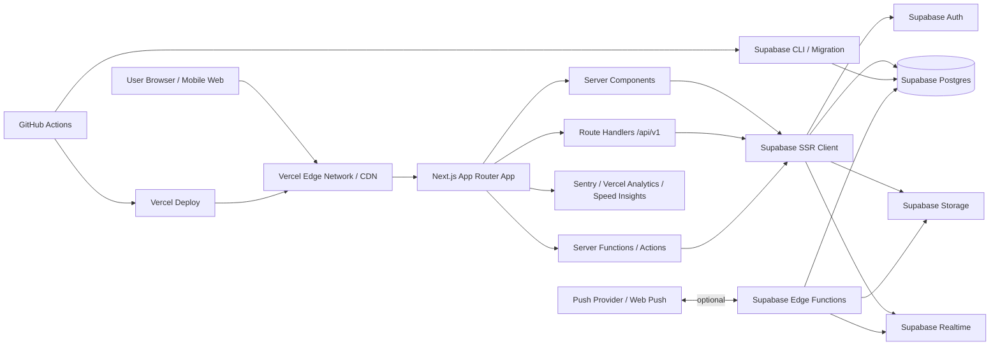
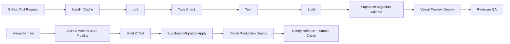

# DrawMate — 기술 아키텍처 문서

버전: Draft v0.1  
작성일: 2026-03-21  
기반 문서: `DrawMate_Project_Guide.docx` 3.7 기술 아키텍처, PRD v0.1, 기능 명세서 v0.1, ERD v0.1, API 명세서 v0.1

---

## 0. 중요 전제

- 본 문서는 DrawMate MVP를 기준으로 **실제로 운영 가능한 아키텍처 선택안**을 정의한다.
- 기술 선택은 **2026-03 기준 최신 안정 버전(Latest Stable)** 과 **상호 호환성** 을 기준으로 검토했다.
- 단, 화면별 상세 레이아웃과 실제 UI 구조는 확인하지 않았으므로, 화면 단위 설명이 필요한 경우에는 반드시 **`DrawMate/Wireframe/` 와이어프레임 확인 필요** 로 본다.
- 본 문서는 **Deprecated API / Deprecated 패턴을 피하고**, App Router + Supabase SSR 기반의 현재 권장 구조를 전제로 한다.

---

## 1. 시스템 아키텍처 개요

DrawMate는 **Vercel 배포형 Next.js 웹 애플리케이션**을 중심으로, 인증(Auth)·데이터베이스(Database)·스토리지(Storage)·실시간(Reactive Messaging/Notification)은 **Supabase** 에 위임하는 구조를 채택한다.

핵심 의도는 다음과 같다.

1. **프론트엔드/백엔드 경계 최소화**: App Router 기반 서버 컴포넌트, Route Handlers, Server Functions를 사용해 개발 생산성을 높인다.
2. **실시간 기능 내장**: 메시징/알림은 Supabase Realtime을 활용해 별도 WebSocket 서버 없이 구현한다.
3. **미디어 친화적 구성**: 포트폴리오 이미지, 프로필 이미지, 채팅 첨부를 Supabase Storage로 통합 관리한다.
4. **운영 단순성**: 배포는 Vercel, 데이터/인증/스토리지는 Supabase로 분리해 초기 DevOps 부담을 줄인다.
5. **확장성**: v1.1 리뷰/평판, v2.0 AI 매칭/결제 연동으로 확장 가능한 구조를 유지한다.

---

## 2. 시스템 아키텍처 다이어그램



### 2.1 데이터 흐름 요약
- 사용자 요청은 Vercel Edge Network를 거쳐 Next.js App Router 앱으로 진입한다.
- 페이지 렌더링과 인증 세션 복원은 **Server Components + Supabase SSR** 로 처리한다.
- 외부 공개 API 및 multipart 업로드는 **Route Handlers** 에서 처리한다.
- 폼 기반 내부 mutation은 **Server Functions(Server Actions 포함)** 을 우선 활용한다.
- 영구 데이터는 Supabase Postgres, 파일은 Storage, 실시간 업데이트는 Realtime으로 분리한다.
- 예외/성능/행동 데이터는 Sentry, Vercel Analytics, Speed Insights로 수집한다.

---

## 3. 기술 스택 상세

## 3.1 권장 기술 스택 표

| 계층 | 기술 | 권장 버전 | 선택 이유 |
|---|---|---:|---|
| Runtime | Node.js | 22.22.1 LTS | Active LTS 계열, Next.js 16 운영 적합 |
| Framework | Next.js | 16.2.1 | App Router 안정화, 최신 성능/캐싱/React 19 지원 |
| UI Runtime | React / React DOM | 19.2.4 / 19.2.4 | 최신 안정 릴리즈, Next.js 16 권장 조합 |
| Language | TypeScript | 5.9.3 | 최신 타입 시스템 개선 및 생태계 호환성 우수 |
| Styling | Tailwind CSS | 4.2.2 | 유틸리티 기반 생산성, Design Token 확장 용이 |
| UI Kit | shadcn/ui CLI | 4.1.0 | Tailwind v4 + React 19 대응, 조합형 컴포넌트 |
| Icons | lucide-react | 0.577.0 | 트리셰이킹 친화적, shadcn/ui와 궁합 우수 |
| Validation | Zod | 4.3.6 | API/폼/서버 입력 스키마 일원화 |
| Client State | Zustand | 5.0.12 | 가벼운 로컬 상태 관리, 에디터/필터 상태 적합 |
| Server State | TanStack Query | 5.91.3 | 서버 상태 캐싱/동기화/무효화 표준 |
| BaaS SDK | `@supabase/supabase-js` | 2.99.3 | Auth/DB/Storage/Realtime 통합 SDK |
| SSR Helper | `@supabase/ssr` | 0.9.0 | App Router 서버사이드 세션 처리 권장 패키지 |
| DB / BaaS | Supabase | Managed latest stable | Auth, Postgres, Storage, Realtime 통합 |
| DB Engine | PostgreSQL | 17 지원 기준 | Supabase 업그레이드 가이드 기준 최신 지원 축 |
| Deploy | Vercel | Managed latest stable | Next.js 1st-party 배포, Preview/Prod 분리 용이 |
| Error Tracking | Sentry for Next.js | 10.45.0 | 프론트+서버 예외 추적, 릴리즈 연계 가능 |
| Product Analytics | `@vercel/analytics` | 2.0.1 | 가벼운 이벤트/페이지 분석 |
| Web Vitals | `@vercel/speed-insights` | 1.3.1 | 실제 사용자 성능 측정 |
| Notifications | Web Push / In-app | 표준 API + 자체 구현 | MVP에서 브라우저 알림과 앱 내 알림 병행 |

### 3.2 선택 이유 요약
- **Next.js App Router** 는 SSR/ISR/Route Handlers/Server Functions 조합으로 제품 개발 속도와 SEO를 동시에 확보하기 좋다.
- **Supabase** 는 DrawMate의 핵심 요구인 인증, PostgreSQL 기반 필터 검색, Storage, Realtime을 하나의 관리형 플랫폼으로 제공한다.
- **Tailwind CSS + shadcn/ui** 는 디자인 시스템을 빠르게 구축하면서도 직접 소스 소유권을 유지할 수 있다.
- **Zustand + TanStack Query** 는 “UI 상태”와 “서버 상태”를 분리 관리하기에 적합하다.
- **Sentry + Vercel Analytics** 는 초기 운영에서 필요한 예외 추적과 기본 지표 수집의 균형점이다.

---

## 4. 호환성 매트릭스 (Compatibility Matrix)

| 조합 | 권장 여부 | 판단 | 사유 |
|---|---|---|---|
| Next.js 16.2.1 + React 19.2.4 + React DOM 19.2.4 | 권장 | 안정 | 공식 최신 릴리즈 조합, App Router 기준 최신 권장 |
| Next.js 16.2.1 + TypeScript 5.9.3 | 권장 | 안정 | 최신 타입 개선과 빌드 도구 호환 |
| Tailwind CSS 4.2.2 + shadcn/ui 4.1.0 | 권장 | 안정 | shadcn이 Tailwind v4 및 React 19 지원을 명시 |
| shadcn/ui 4.1.0 + Sonner 2.x | 권장 | 안정 | shadcn 문서에서 toast 대신 sonner 방향 제시 |
| Zustand 5.0.12 + TanStack Query 5.91.3 | 권장 | 안정 | 역할 분리형 상태 관리 패턴에 적합 |
| Supabase JS 2.99.3 + `@supabase/ssr` 0.9.0 | 강력 권장 | 안정 | Auth Helpers 구패키지 대체 및 App Router 적합 |
| App Router + Route Handlers + Server Functions | 강력 권장 | 안정 | 신규 Next.js 구조에 부합 |
| App Router + `pages/api` 혼용 | 비권장 | 제한적 허용 | 레거시 혼용 가능하나 구조 복잡성 증가 |
| `@supabase/auth-helpers-nextjs` | 금지 | Deprecated 경로 | `@supabase/ssr` 로 마이그레이션 권장 |
| Supabase Realtime Postgres Changes 단독 대규모 사용 | 제한적 | 소규모만 적합 | 대규모/보안 요구 시 Broadcast+Authorization 권장 |
| Storage 대용량 파일에 standard upload만 사용 | 비권장 | 제한 | 6MB 이상은 TUS resumable 업로드가 적합 |

### 4.1 최적 버전 조합 제안

```text
Node.js 22.22.1 LTS
Next.js 16.2.1
React 19.2.4
React DOM 19.2.4
TypeScript 5.9.3
Tailwind CSS 4.2.2
shadcn/ui CLI 4.1.0
Zustand 5.0.12
TanStack Query 5.91.3
Zod 4.3.6
@supabase/supabase-js 2.99.3
@supabase/ssr 0.9.0
Sentry for Next.js 10.45.0
@vercel/analytics 2.0.1
@vercel/speed-insights 1.3.1
```

### 4.2 충돌 회피 메모
- **React 19 이전 버전 고정** 은 최신 Next.js 기능 활용을 제한할 수 있으므로 피한다.
- **Supabase Auth Helpers 구패키지** 는 유지보수 경로가 아니므로 신규 프로젝트에서 채택하지 않는다.
- **App Router 기준** 이므로 신규 API는 `app/api/**/route.ts` 기준으로 통일하고, 레거시 `pages/api` 는 사용하지 않는다.
- **UI 토스트** 는 shadcn 문서 기준 deprecated toast 대신 `sonner` 사용을 권장한다.
- **Storage 업로드** 는 표준 업로드와 TUS 업로드를 파일 크기 기준으로 분리해 운영 리스크를 낮춘다.

---

## 5. 대안 기술 대비 장단점

## 5.1 프레임워크 대안 비교

| 항목 | Next.js | Remix | Nuxt |
|---|---|---|---|
| DrawMate 적합성 | 가장 높음 | 중간 | 낮음 |
| 장점 | App Router, Vercel 연동, SSR/SEO 강함 | 폼/액션 구조 강함 | Vue 생태계 선호 시 장점 |
| 단점 | 러닝커브와 캐시 모델 복잡성 | 생태계 규모/템플릿 적음 | React/shadcn/TanStack 중심 선택과 거리 있음 |
| 결론 | **채택** | 비채택 | 비채택 |

## 5.2 BaaS 대안 비교

| 항목 | Supabase | Firebase | Appwrite |
|---|---|---|---|
| DrawMate 적합성 | 가장 높음 | 중간 | 중간 |
| 장점 | PostgreSQL, RLS, SQL 친화적, Realtime/Storage/Auth 통합 | 빠른 초기 구축, 모바일 친화 | 오픈소스 자가호스팅 매력 |
| 단점 | 고급 검색/복잡 정책 설계는 SQL 이해 필요 | 관계형 탐색/정렬/필터가 덜 자연스러움 | 생태계/문서/운영 사례 상대적 제한 |
| 결론 | **채택** | 비채택 | 비채택 |

## 5.3 UI 레이어 대안 비교

| 항목 | Tailwind + shadcn/ui | MUI | Chakra UI |
|---|---|---|---|
| 장점 | 소스 소유권, 커스터마이징, 디자인 시스템 구축 용이 | 풍부한 컴포넌트 | DX 우수 |
| 단점 | 직접 조립 부담 | 스타일 오버라이드 비용 | 대규모 디자인 커스터마이징 시 제약 |
| 결론 | **채택** | 비채택 | 비채택 |

## 5.4 상태 관리 대안 비교

| 항목 | Zustand + TanStack Query | Redux Toolkit | Context 다중 사용 |
|---|---|---|---|
| 장점 | 역할 분리 명확, 보일러플레이트 적음 | 표준성/미들웨어 생태계 | 단순 기능엔 가벼움 |
| 단점 | 규칙 없으면 상태 분산 위험 | 과한 보일러플레이트 가능 | 서버 상태 관리에 부적합 |
| 결론 | **채택** | 비채택 | 부분 보조만 허용 |

---

## 6. 프론트엔드 아키텍처

## 6.1 App Router 기반 디렉토리 구조

> 실제 화면 컴포넌트 계층과 세부 배치는 `DrawMate/Wireframe/` 와이어프레임 확인 필요

```text
src/
  app/
    (marketing)/
      page.tsx
      explore/
        page.tsx
      portfolio/
        [portfolioSlug]/
          page.tsx
      users/
        [userId]/
          page.tsx
    (auth)/
      sign-in/
        page.tsx
      sign-up/
        page.tsx
      onboarding/
        page.tsx
    (app)/
      studio/
        page.tsx
        portfolios/
          page.tsx
          new/
            page.tsx
          [portfolioId]/
            edit/
              page.tsx
      bookmarks/
        page.tsx
      messages/
        page.tsx
        [conversationId]/
          page.tsx
      notifications/
        page.tsx
      settings/
        page.tsx
        profile/
          page.tsx
        account/
          page.tsx
        notifications/
          page.tsx
    api/
      v1/
        auth/
          sign-up/route.ts
          sign-in/route.ts
        me/
          route.ts
          profile/route.ts
        portfolios/
          route.ts
          [portfolioId]/
            route.ts
            publish/route.ts
            images/route.ts
            images/
              reorder/route.ts
        tags/route.ts
        templates/route.ts
        bookmarks/route.ts
        conversations/
          route.ts
          direct/route.ts
          [conversationId]/
            messages/route.ts
        messages/
          attachments/route.ts
        notifications/
          route.ts
          read-all/route.ts
          [notificationId]/
            read/route.ts

  components/
    ui/
    layout/
    portfolio/
    portfolio-editor/
    search/
    profile/
    messaging/
    notifications/

  lib/
    supabase/
      browser-client.ts
      server-client.ts
      middleware.ts
    auth/
    constants/
    utils/
    analytics/

  server/
    actions/
    queries/
    services/
    mappers/

  store/
    ui-store.ts
    explore-store.ts
    editor-store.ts

  hooks/
  types/
  validators/
  styles/
```

### 6.2 레이어링 원칙
- `app/`: 라우팅, 레이아웃, 서버 렌더링 진입점
- `components/`: 재사용 가능한 UI와 도메인 UI
- `server/`: 서버 전용 비즈니스 로직, DB 연동, 외부 서비스 호출
- `store/`: 클라이언트 로컬 상태
- `validators/`: Zod 스키마
- `types/`: 프론트/서버 공용 타입
- `lib/supabase/`: 브라우저/서버/미들웨어용 클라이언트 팩토리

## 6.3 상태관리 전략

### Zustand 역할
- 검색 필터 패널 열림/닫힘
- 포트폴리오 에디터 임시 UI 상태
- 이미지 드래그 정렬 로컬 프리뷰 상태
- 메시지 입력창 draft
- 알림 패널/시트 UI 상태

### TanStack Query 역할
- 포트폴리오 목록 조회 캐시
- 포트폴리오 상세 조회
- 북마크 목록/상태
- 대화방 목록 및 메시지 초기 로딩
- 알림 목록
- 사용자 프로필 조회

### 분리 원칙
- **서버에서 truth가 결정되는 데이터** 는 TanStack Query
- **브라우저 세션 중 임시로만 필요한 UI 상태** 는 Zustand
- 동일 데이터의 source of truth를 두 시스템에 이중 저장하지 않는다.

## 6.4 렌더링 전략

| 화면 유형 | 권장 렌더링 | 이유 |
|---|---|---|
| 홈 / 탐색 리스트 | SSR + 점진적 클라이언트 보강 | SEO와 초기 로딩 균형 |
| 포트폴리오 상세 | SSR | 검색 유입, OG/메타데이터 중요 |
| 포트폴리오 에디터 | CSR 중심 | 상호작용/업로드 비중 큼 |
| 메시지 리스트 / 대화방 | CSR + Realtime | 지속 업데이트 필요 |
| 설정 / 내 프로필 | SSR 또는 CSR 혼합 | 인증 기반 페이지 |
| 알림 센터 | CSR + polling/realtime | 실시간성 필요 |

## 6.5 이미지 최적화 전략

- 원본 이미지는 `portfolio-originals` bucket에 비공개 저장
- 공개용 파생 이미지(thumb, card, detail)는 `portfolio-public` 에 저장하거나 Supabase 이미지 변환 기능을 사용
- `<Image />` 는 Next.js `next/image` 를 사용하고, remotePatterns에 Supabase Storage 도메인을 등록
- 목록 화면은 **썸네일 우선 로딩**, 상세 화면에서만 큰 이미지 로딩
- 가급적 `webp` 또는 `avif` 우선 사용
- 업로드 직후 클라이언트에서 파일 형식/크기/개수를 선검증
- 6MB 이상 또는 네트워크 불안정 환경을 고려해 **TUS resumable upload** 를 지원
- 실제 썸네일 크롭/레이아웃 비율은 `DrawMate/Wireframe/` 확인 필요

## 6.6 SEO 전략

- 공개 페이지는 모두 **server-rendered metadata** 구성
- 포트폴리오 상세는 `generateMetadata` 로 제목/요약/대표 이미지/OG 태그 생성
- `sitemap.xml`, `robots.txt`, canonical URL 제공
- 구조화 데이터(Structured Data)는 `ProfilePage`, `CollectionPage`, `CreativeWork` 중심으로 적용 검토
- Draft/비공개 포트폴리오, 메시지, 북마크, 설정 등은 `noindex`
- 탐색 페이지는 필터 조합이 과도하게 중복 URL을 만들지 않도록 canonical 전략 적용

---

## 7. 백엔드 아키텍처 (Supabase)

## 7.1 역할 분리

| 구성 요소 | 주요 책임 |
|---|---|
| Supabase Auth | 이메일/소셜 로그인, 세션/JWT 발급 |
| Supabase Postgres | 프로필, 포트폴리오, 태그, 북마크, 메시지, 알림 저장 |
| Supabase Storage | 포트폴리오 이미지, 프로필 이미지, 채팅 첨부 |
| Supabase Realtime | 메시지/알림 실시간 반영 |
| Supabase Edge Functions | 푸시 발송, 배치 작업, 외부 연동, 비밀키 사용 로직 |
| Database Functions / RPC | direct conversation 생성, publish 처리, reorder 처리, 카운터 업데이트 |

## 7.2 Database Functions / RPC 활용 범위

### 권장 RPC 목록
1. `create_direct_conversation(target_user_id uuid)`  
   - 중복 direct conversation 방지  
   - participant row 동시 생성

2. `publish_portfolio(portfolio_id uuid)`  
   - 필수 조건 검증 후 draft → published 전환  
   - `published_at` 설정

3. `reorder_portfolio_images(portfolio_id uuid, ordered_ids uuid[])`  
   - 순서 재정렬과 소유권 검증 일괄 처리

4. `mark_notifications_read(notification_ids uuid[])`  
   - 일괄 읽음 처리

5. `increment_portfolio_view(portfolio_id uuid)`  
   - 과도한 직접 update 대신 서버 제어형 카운터 증가

6. `search_portfolios(...)`  
   - 복합 필터/정렬/커서 기반 조회 캡슐화가 필요할 경우 도입

## 7.3 Edge Functions 활용 범위

### MVP 범위
- Web Push 발송 대행
- 이미지 후처리(선택)
- 업로드 완료 후 파생 이미지 생성(선택)
- 알림 fan-out
- 스팸/악성 업로드 검사(선택)
- 예약 정리 작업(만료 draft, orphan attachment cleanup)

### v1.1 / v2.0 확장 범위
- 외부 결제 서비스 연동
- AI 매칭 추천 배치
- 콘텐츠 moderation
- 이메일 digest 발송

## 7.4 RLS 정책 개요

- 공개 탐색:
  - `published + public` 포트폴리오만 익명 조회 허용
- 프로필:
  - 공개 프로필은 익명 조회 가능
  - 개인 설정 필드는 본인만 수정
- 포트폴리오:
  - draft/archived는 작성자 본인만 접근
- 북마크:
  - 본인만 조회/추가/삭제 가능
- 대화방/메시지:
  - participant만 조회 가능
  - 본인이 속한 conversation에만 메시지 insert 가능
- 알림:
  - 본인 row만 조회/수정 가능
- Storage:
  - 포트폴리오 공개 썸네일은 public read
  - 원본/채팅 첨부는 signed URL 또는 participant 기반 접근

## 7.5 Storage 구조

| Bucket | 공개 여부 | 용도 | 비고 |
|---|---|---|---|
| `portfolio-originals` | Private | 원본 포트폴리오 이미지 | 작성자만 업로드/수정 |
| `portfolio-public` | Public 또는 Signed | 공개용 파생 이미지 | 카드/상세/OG 이미지 |
| `profile-avatars` | Public | 프로필 아바타 | 과도한 원본 노출 금지 |
| `chat-attachments` | Private | 채팅 첨부 이미지 | participant만 접근 |
| `system-template-assets` | Public | 템플릿 썸네일/기본 에셋 | 앱 배포 자산 보조 |

### 경로 규칙 예시
```text
portfolio-originals/{userId}/{portfolioId}/{imageId}.jpg
portfolio-public/{userId}/{portfolioId}/{variant}/{imageId}.webp
profile-avatars/{userId}/avatar.webp
chat-attachments/{conversationId}/{messageId}/{fileId}.jpg
system-template-assets/{templateKey}/cover.png
```

## 7.6 Realtime 채널 설계

| 채널 | 방식 | 권장 형태 | 이유 |
|---|---|---|---|
| 메시지 신규 수신 | Broadcast + private channel | `conversation:{conversationId}` | 보안/확장성 |
| 대화방 목록 갱신 | Broadcast 또는 Postgres Changes | `user:{userId}:conversations` | last_message_at 갱신 반영 |
| 알림 신규 생성 | Broadcast + private channel | `user:{userId}:notifications` | 개인화 알림 |
| 북마크/프로필 변경 | 비실시간 또는 polling | 불필요 | MVP 실시간 우선순위 낮음 |

### 원칙
- 단순 개발 편의성만 보면 Postgres Changes가 쉽지만, **확장성과 권한 모델** 까지 고려하면 Broadcast + Realtime Authorization을 우선한다.
- 대화 내용 본문을 Realtime payload에 과도하게 싣지 말고, 필요 최소 필드만 보내고 상세는 API/쿼리로 보강한다.

---

## 8. 인프라 & DevOps

## 8.1 환경 분리 (Environment Strategy)

| 환경 | 목적 | 배포 | 데이터 |
|---|---|---|---|
| `dev` | 로컬 개발 | local / preview | 개발용 Supabase 또는 로컬 |
| `staging` | QA / UAT / 내부 리뷰 | Vercel Preview 또는 Staging 프로젝트 | 별도 Supabase 프로젝트 권장 |
| `prod` | 실제 서비스 | Vercel Production | 운영 Supabase 프로젝트 |

### 권장 원칙
- **Supabase 프로젝트는 최소 staging / prod 분리**
- Vercel은 PR마다 Preview 배포를 사용
- 운영 비밀키는 환경별로 분리
- Edge Function 비밀값, Web Push 키, Sentry DSN도 환경별 분리

## 8.2 CI/CD 파이프라인



### GitHub Actions 권장 단계
1. dependency install / cache
2. ESLint
3. TypeScript type check
4. unit/integration test
5. Next.js build
6. Supabase migration dry-run
7. preview deploy
8. production deploy on merge/tag

## 8.3 배포 체크리스트
- DB migration 순서 검증
- RLS 정책 적용 여부 검증
- Storage bucket 정책 점검
- 환경 변수 누락 검사
- preview에서 로그인/업로드/메시징 smoke test
- source map 업로드 및 Sentry release 연결
- robots / sitemap / canonical 점검

## 8.4 모니터링 & 로깅

### Sentry
- 프론트엔드 런타임 예외
- Route Handlers 서버 예외
- Server Function 예외
- release / commit 연동
- 사용자 영향도 추적

### Vercel Analytics / Speed Insights
- 페이지뷰, 유입, 경로 성능
- Core Web Vitals
- 실제 사용자 성능 추세

### Supabase 관측 포인트
- slow query
- connection / database usage
- Realtime 연결 수
- Storage 사용량
- Auth 실패율

## 8.5 보안 체크리스트

### 인증/인가
- [ ] 모든 민감 Route Handler 에서 세션/JWT 검증
- [ ] 모든 Server Function 에서 사용자 인증 재검증
- [ ] RLS 없는 public 테이블 금지
- [ ] 서비스 롤 키는 서버 전용

### 데이터 보호
- [ ] 개인정보 최소 수집
- [ ] 비공개 포트폴리오 직접 URL 노출 금지
- [ ] private bucket 접근은 signed URL 또는 권한 검증 경유
- [ ] 메시지/알림 payload 최소화

### 업로드 보안
- [ ] MIME type, 확장자, 용량, 개수 검증
- [ ] 이미지 EXIF/메타데이터 제거 검토
- [ ] 채팅 첨부 악성 파일 우회 차단
- [ ] 대용량 업로드는 resumable upload 사용

### 애플리케이션 보안
- [ ] Rate limiting
- [ ] CSP / HSTS / Referrer-Policy / X-Frame-Options 검토
- [ ] secret rotation 절차 마련
- [ ] 감사 로그(audit log) 필요 이벤트 정의
- [ ] dependency update / advisories 주기 점검

---

## 9. 성능 및 확장 전략

## 9.1 검색/탐색 성능
- 태그 조합과 정렬 기준에 맞는 인덱스 설계
- 목록 쿼리는 cursor-based pagination 사용
- 카드 목록은 필요한 필드만 projection
- 인기/북마크 카운트는 집계 업데이트 전략 사용

## 9.2 메시징 성능
- 대화방 목록은 최신 메시지 요약 필드 별도 유지
- 메시지 본문은 페이지네이션
- unread count는 participant 단위 캐시 컬럼 고려
- Realtime payload는 최소화하고 필요 시 재조회

## 9.3 이미지/미디어 성능
- 대표 이미지 썸네일 선생성 또는 on-the-fly transform
- 긴 포트폴리오는 lazy loading
- 상세 페이지는 viewport 기반 이미지 로딩
- OG 이미지는 별도 최적화 경로 사용

## 9.4 운영 확장성
- v1.1 이전까지는 단일 Supabase 프로젝트 규모로 충분
- 트래픽 증가 시:
  - 검색 전용 materialized view 또는 별도 검색엔진
  - Broadcast 중심 Realtime 최적화
  - 비동기 후처리 강화(Edge Functions / queue)
  - 이미지 파생본 캐싱 강화

---

## 10. 권장 구현 원칙 요약

1. **UI 구조는 `DrawMate/Wireframe/` 기준으로 확정**한다.
2. **Next.js App Router + Route Handlers + Server Functions** 를 기본 구조로 채택한다.
3. **Supabase Auth Helpers 대신 `@supabase/ssr`** 를 사용한다.
4. **RLS는 필수**이며, UI 제한을 신뢰하지 않는다.
5. **메시징/알림은 private Realtime channel** 을 사용한다.
6. **파일 업로드는 파일 크기별 전략 분리**(standard vs TUS)로 운영 리스크를 줄인다.
7. **상태관리 역할 분리**(Zustand = UI state, TanStack Query = server state)를 엄격히 유지한다.
8. **SEO는 공개 포트폴리오 중심**으로 최적화하고, 내부 페이지는 색인 제외한다.

---

## 11. 참고 자료

- https://nextjs.org/blog
- https://www.npmjs.com/package/next
- https://www.npmjs.com/package/react
- https://www.npmjs.com/package/react-dom
- https://www.npmjs.com/package/typescript
- https://nextjs.org/docs/app/getting-started/project-structure
- https://nextjs.org/docs/app/getting-started/route-handlers
- https://nextjs.org/docs/app/guides/forms
- https://nextjs.org/docs/app/getting-started/upgrading
- https://supabase.com/docs/guides/auth/server-side/creating-a-client
- https://supabase.com/docs/guides/auth/server-side/migrating-to-ssr-from-auth-helpers
- https://supabase.com/docs/guides/realtime/authorization
- https://supabase.com/docs/guides/realtime/subscribing-to-database-changes
- https://supabase.com/docs/guides/storage/uploads/standard-uploads
- https://supabase.com/docs/guides/storage/uploads/resumable-uploads
- https://supabase.com/docs/guides/storage/serving/image-transformations
- https://supabase.com/docs/guides/storage/security/access-control
- https://supabase.com/docs/guides/platform/upgrading
- https://www.npmjs.com/package/@supabase/supabase-js
- https://www.npmjs.com/package/@supabase/ssr
- https://www.npmjs.com/package/tailwindcss
- https://www.npmjs.com/package/zustand
- https://www.npmjs.com/package/@tanstack/react-query
- https://www.npmjs.com/package/zod
- https://www.npmjs.com/package/lucide-react
- https://ui.shadcn.com/docs
- https://www.npmjs.com/package/shadcn
- https://www.npmjs.com/package/@sentry/nextjs
- https://www.npmjs.com/package/@vercel/analytics
- https://www.npmjs.com/package/@vercel/speed-insights
- https://nodejs.org/en/blog/release
- 내부 기준 문서: `DrawMate_Project_Guide.docx`